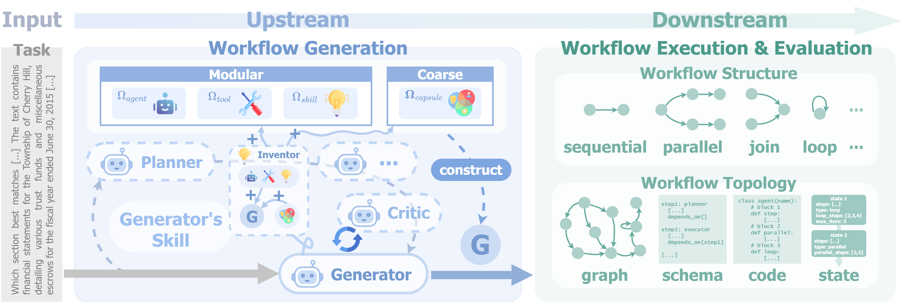
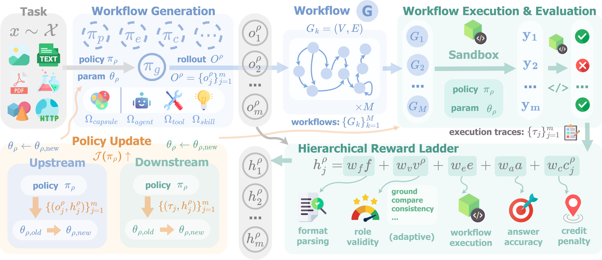

<h1 align="center">FloWright: It Takes Workflows to Evolve Better Workflows</h1>

<p align="center">
  <a href="https://arxiv.org/abs/2610.01026"></a>
  &nbsp;&nbsp;&nbsp;&nbsp;
  <a href="https://arxiv.org/pdf/2610.01026"></a>
  &nbsp;&nbsp;&nbsp;&nbsp;
  <a href="https://xhguo7.github.io/FloWright/"></a>
  &nbsp;&nbsp;&nbsp;&nbsp;
  <a href="https://github.com/xhguo7/FloWright"></a>
  &nbsp;&nbsp;&nbsp;&nbsp;
  <a href="https://huggingface.co/papers/2610.01026"></a>
</p>

<p align="center">
  
</p>

> **TL;DR.**
Multi-agent workflows are usually improved by training only the workflow generator, while every other agent that builds or runs the workflow stays fixed. **FloWright** uses the workflow itself as a *harness*: one execute-and-grade signal that evaluates a workflow, trains any role that builds or executes it, and distills a reusable prior at test time. A **hierarchical, structure-aware reward** turns the single sparse outcome of a workflow into role-level feedback with no additional models, labels, or executions. Small open models trained with FloWright improve by up to **↑7.41%**, and co-evolving more roles (**↑5.03%**) gains more than optimizing one alone (**↑2.83%**).

---

## **Method Overview**

A task *x* is solved by a **workflow** *G* = (*V*, *E*): a directed graph whose nodes are agents, tools, or skills drawn from a shared pool *Ω*, and whose edges carry data and control flow. Upstream, the **Generator** *π<sub>g</sub>* writes *G* for the task. Downstream, the **harness** *H* executes *G* and grades its answer *y*:

> *x* &nbsp;→<sup>*π<sub>g</sub>*</sup>&nbsp; *G* &nbsp;→<sup>*H*</sup>&nbsp; (*y*, *h*(*G*, *x*)), &nbsp;&nbsp; *h*(*G*, *x*) ∈ [0, 1]

The same signal *h* serves three purposes: the **evaluation metric**, the **training signal** for any role, and the **test-time objective**.

<p align="center">
  
  <p align="center"><em>Workflow generation and execution form a coupled on-policy loop: upstream proposes workflows, downstream executes them, and the harness turns execution outcomes into <strong>role-level learning signals</strong>.</em></p>
</p>

**Hierarchical reward.** Instead of one pass-or-fail outcome, each role *ρ* receives a staged ladder of auto-verified terms, from its own output to the task outcome:

> *h<sup>ρ</sup>* = *w<sub>f</sub>* · *f* + *w<sub>v</sub>* · *v<sup>ρ</sup>* + *w<sub>e</sub>* · *e* + *w<sub>a</sub>* · *a* + *w<sub>c</sub>* · *c<sup>ρ</sup>*

- **Format** (*f*): the role's output parses.
- **Validity** (*v<sup>ρ</sup>*): the role's own contribution is valid, e.g., the Generator's workflow is a well-formed graph over the pool.
- **Execution** (*e*): the workflow runs to a final answer.
- **Answer** (*a*): how correct that answer is.
- **Credit** (*c<sup>ρ</sup>* ∈ [−1, 0]): the fraction of the role's own nodes that root-cause a failure, read from the execution trace the harness already records.

**Workflow design space.** A workflow is written in one of four **topologies** (step schema, agent graph, state machine, block code), each converted into the same executable graph. The pool is presented at a **modular** granularity (separate agents, tools, and skills) or as **capsules** (each agent bundled with the tools and skills it needs), and can be **static**, **dynamic** (the Generator's Inventor skill creates missing components on demand), or **grown** from past experiences.

---

## **🌳 I. Env Setup**

**1. Create env**
```bash
conda env create -f environment.yml
conda activate flowright
```

**2. Install FloWright**

The environment already installs the harness, which is all that workflow generation, execution, grading, and test-time distillation need.
RL training needs one more install:

```bash
# RL training support, and vLLM for serving local models
pip install -e ".[vllm]"
```

**3. Keys and local paths**

API keys and machine-local paths are read from one-line files under `custom/`, which is gitignored (see [custom/README.md](custom/README.md)):

```bash
echo /path/to/cache > custom/cache_dir
echo <your-openai-key> > custom/openai_api_key
```

**4. Code sandbox (optional)**

Code written by agents runs in a subprocess sandbox. It uses a sibling conda env named `test` if one exists, otherwise the current interpreter. To choose one explicitly:

```bash
conda create -n flowright-sandbox python=3.12 -y
conda run -n flowright-sandbox pip install -r harness/requirements-sandbox.txt
export FLOWRIGHT_SANDBOX_PYTHON=$(conda run -n flowright-sandbox which python)
```


## **🌟 II. Workflow Harness**

> The harness generates a task-specific workflow, executes it with real agent, tool, and skill runtimes, and grades the answer. The same code path is the evaluation metric, the RL reward, and the test-time objective.

### **2.1 Quick Run**

Serve a local model with any OpenAI-compatible server, then generate, execute, and grade one workflow per task:

```bash
# (1) Serve the backbone
vllm serve Qwen/Qwen3.5-4B --port 8000

# (2) Run the harness
cd harness
FLOWRIGHT_TASK_FILE=/path/to/tasks.jsonl \
FLOWRIGHT_POOL_SCOPE=all \
VLLM_BASE_URL=http://localhost:8000/v1 \
bash scripts/flowright/run_flowright.sh
```

Settings live at the top of the script and can be overridden from the environment. `python flowright.py --help` lists every option.

### **2.2 Workflow Design Space**

| Variable | Values | Description |
| :--- | :--- | :--- |
| `FLOWRIGHT_TOPOLOGY` | `schema` \| `graph` \| `state_machine` \| `code` | Representation the Generator writes the workflow in |
| `FLOWRIGHT_POOL_FORM` | `modular` \| `capsule` | Pool granularity |
| `FLOWRIGHT_POOL_SCOPE` | `all` \| `basic` \| `none` | How much of the pool the Generator is shown |
| `FLOWRIGHT_ENABLE_DYNAMIC_POOL` | `true` \| `false` | Let the Generator's Inventor skill create missing components |
| `FLOWRIGHT_DYNAMIC_POOL_GROW` | `off` \| `success` \| `all` | Which created components are kept to grow the pool |
| `FLOWRIGHT_ENABLE_PLANNER` | `off` \| `planner` \| `agent_aware_planner` | Add a Planner before the Generator |
| `FLOWRIGHT_MAX_ITER_CRITIC` | integer | Critic revision rounds (`0` disables the Critic) |

### **2.3 Run Inference & Evaluation**

Every role takes its own engine and model, so roles can run on different backbones. For example, to run every role on an OpenAI model:

```bash
FLOWRIGHT_GEN_ENGINE=openai FLOWRIGHT_GEN_MODEL=gpt-5-mini \
FLOWRIGHT_RUNTIME_ENGINE=openai FLOWRIGHT_RUNTIME_MODEL=gpt-5-mini \
FLOWRIGHT_TASK_FILE=/path/to/tasks.jsonl FLOWRIGHT_POOL_SCOPE=all \
bash scripts/flowright/run_flowright.sh
```

### **2.4 Re-Grading Saved Workflows**

Execute and grade the workflows of a finished run again, for example with a different downstream backbone:

```bash
cd harness
EVAL_CANDIDATE_FILE=/path/to/run/eval_results.json \
EVAL_TASK_FILE=/path/to/tasks.jsonl \
EVAL_RUNTIME_MODEL=Qwen/Qwen3.5-9B \
bash scripts/eval/run_eval.sh
```

Answers that no rule can decide, such as plotting code, are scored by an LLM judge over a finished run:

```bash
cd harness
python -m evaluate.llm_graders.llm_grader --run /path/to/run --engine openai --model gpt-5.6-luna
```


## **🌟 III. Test-Time Optimization: Meta Distillation**

With weights fixed, the harness distills its own experiences into a prior that later tasks reuse. The same script runs it:

```bash
cd harness

# (1) Internal distillation: distill a prior from the run's own trajectories every 10 tasks
FLOWRIGHT_EVERY_K=10 FLOWRIGHT_META_TARGETS=generator \
FLOWRIGHT_TASK_FILE=/path/to/tasks.jsonl FLOWRIGHT_POOL_SCOPE=all \
bash scripts/flowright/run_flowright.sh

# (2) Meta distillation: additionally distill successful experiences into 5-shot cases
FLOWRIGHT_EVERY_K=10 FLOWRIGHT_META_TARGETS=generator \
FLOWRIGHT_INVENTOR_FEWSHOT=grown FLOWRIGHT_INVENTOR_FEWSHOT_K=5 \
FLOWRIGHT_TASK_FILE=/path/to/tasks.jsonl FLOWRIGHT_POOL_SCOPE=all \
bash scripts/flowright/run_flowright.sh
```


## **🌟 IV. Train-Time Optimization: Reinforcement Learning**

### **4.1 Agent Training**

```bash
# (1) Serve the frozen downstream backbone
vllm serve Qwen/Qwen3.5-9B --port 8000

# (2) Train the Generator with GRPO
TRAIN_FILES=/path/to/train.parquet VAL_FILES=/path/to/val.parquet \
RUNTIME_BASE_URL=http://localhost:8000/v1 \
bash flow/generator/scripts/run_generator_grpo.sh
```

For example, to train with GRPO at a group size of 16:

```bash
ADV_ESTIMATOR=grpo ROLLOUT_N=16 \
TRAIN_FILES=... VAL_FILES=... RUNTIME_BASE_URL=... \
bash flow/generator/scripts/run_generator_grpo.sh
```

### **4.2 Checkpoint Merging**

```bash
# Merge the checkpoint
CKPT_DIR=/path/to/experiment bash flow/merger/run_merger.sh
```

### **4.3 Agent Evaluation**

```bash
# (1) Serve the merged checkpoint
vllm serve /path/to/experiment/global_step_<n>/merged_hf --port 8001

# (2) Run evaluation
cd harness
FLOWRIGHT_GEN_MODEL=/path/to/experiment/global_step_<n>/merged_hf \
FLOWRIGHT_GEN_BASE_URL=http://localhost:8001/v1 \
FLOWRIGHT_TASK_FILE=/path/to/tasks.jsonl \
bash scripts/flowright/run_flowright.sh --training-config /path/to/experiment/training_config.json
```


## **🥰 Acknowledgement**

Our RL training is built upon [VERL](https://verl.readthedocs.io/en/latest/index.html). We sincerely thank their exceptional work!


## **📃 Citation**
If you find our work interesting, please kindly cite:
```
@article{guo2026flowright,
    title={FloWright: It Takes Workflows to Evolve Better Workflows},
    author={Guo, Xuehang and Wang, Haoyu and Chen, Haifeng and Chen, Yangyi and Wang, Zhenhailong and Wang, Qingyun},
    journal={arXiv preprint arXiv:2610.01026},
    url={https://arxiv.org/abs/2610.01026},
    year={2026}
}
```
